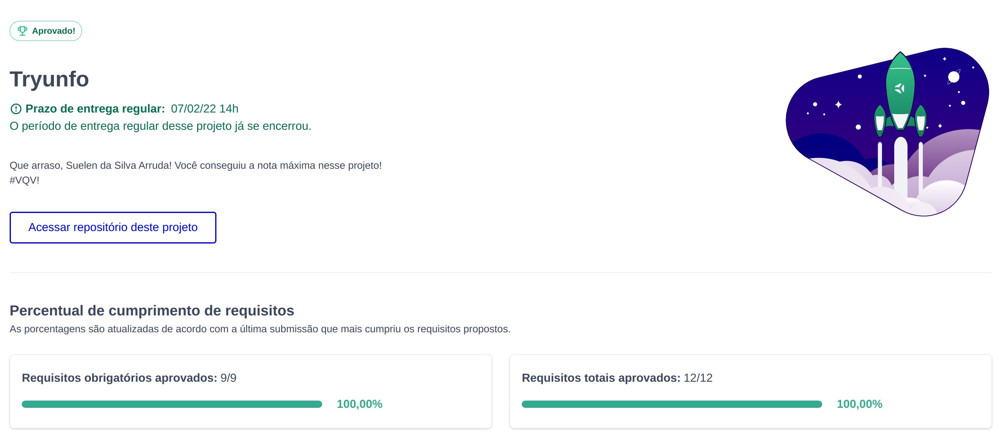

# :wine_glass: Projeto Tryunfo: Spirito diVino :wine_glass: :underage:

Neste projeto foi desenvolvido um jogo no estilo Super Trunfo! Ao utilizar essa aplicação uma pessoa usuária é ser capaz de:

  * Criar um baralho, com seus vinhos favoritos ;

  * Adicionar e remover os seus vinhos(cartas)  da sua adega (baralho);

  * Visualizar todas as cartas que foram adicionadas ao baralho;

  

## Habilidades desenvolvidas 

  * Ler o estado de um componente e usá-lo para alterar o que exibimos no browser

  * Inicializar um componente, dando a ele um estado pré-definido

  * Atualizar o estado de um componente

  * Capturar eventos utilizando a sintaxe do React

  * Criar formulários utilizando sintaxe JSX com as tags: `input`, `textarea`, `select`, `form`, `checkbox`

  * Transmitir informações de componentes filhos para componentes pais via callbacks

---

## Desenvolvimento

Foi desenvolvida uma aplicação em React com manipulação de estados em classes. Essa aplicação simula um jogo de **Super Trunfo**. Onde o usuário pode adicionar à sua adega os vinhos que mais aprecia.

Na renderização das cartas, a aplicação possui três filtros de listagem de cartas: filtro por **nome**, por **raridade** e por **Super Trunfo**. Os filtros **nome** e **raridade** são acumulativos. O filtro **Super Trunfo** funciona de forma independente.

# Observações técnicas
. Instale as dependências e inicialize o projeto
  * Instale as dependências:
    * `npm install`
  * Inicialize o projeto:
    * `npm start`
     
### Stack utilizada

  
   
  
 

---

### Status do Projeto 

--- 

### Gif do Projeto finalizado

:construction: WOMAN AT WORK :construction:

---

### 🔗 Links

